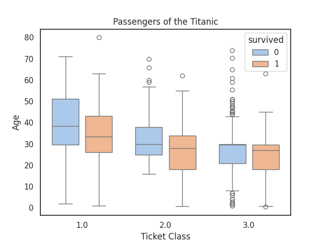

# Titanic

## Histogram

Chance of survival on the Titanic was **strongly age-dependent**.
Young children were prioritized and had a very **high** survival rate.

Most of the passengers who died were between ages of 20 ~ 30, reflecting the
demographics of the passengers and **their low priority for lifeboat access**.

## Boxplot

Wealthier passengers _(1st Class)_ were on average, older.
Your ticket class on the Titanic was a strong predictor not only of your wealth
but also of your age.
